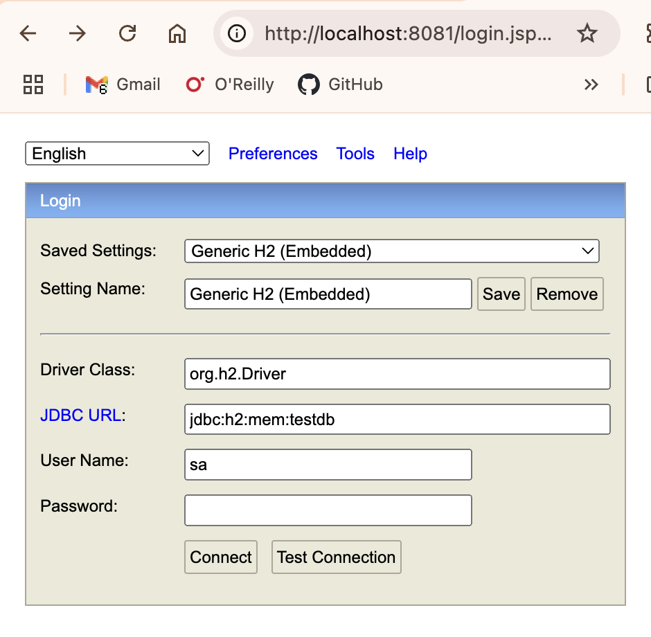

# DSA Final Sprint – Binary Search Tree Application

## Overview:

This is a Spring Boot web application that:
- Accepts user input as a list of numbers
- Builds a **Binary Search Tree (BST)** from those numbers
- Optionally constructs a **Balanced BST**
- Stores the input and resulting tree structure in a database
- Allows users to view all **previously generated trees**

---

### Features:

- **Interactive Form** – Enter numbers and generate a BST
- **Balanced Tree Option** – Checkbox to generate a balanced BST
- **View History** – Displays all previously generated trees from the database
- **JSON Output** – Tree structures displayed in a clean JSON format
- **Responsive UI** – Styled HTML pages with a modern, clean design

---

### Project Structure:

---

### How It Works:

1. **User enters numbers** on the `/enter-numbers` page.
2. Chooses whether to:
    - Build a standard BST
    - Build a balanced BST (bonus feature)
3. On submission:
    - The BST is generated.
    - The tree is converted to **JSON**.
    - The input and output are saved in the database.
4. **Previous Trees** button fetches stored records and displays them.

---

### Technologies Used:

- **Java 17+**
- **Spring Boot**
- **Spring Data JPA**
- **H2 Database**
- **Thymeleaf**
- **JUnit 5**

---

### Testing:

The project includes unit tests for:
- BST insertion
- JSON tree conversion
- Balanced BST creation

Run tests with:
`mvn test`

### How to Run:
1.	Clone the repository:
`git clone https://github.com/yourusername/dsa-final-sprint.git`

2. Navigate to the project folder:
`cd dsa-final-sprint`

3.	Run the application:
`mvn spring-boot:run`

Open the browser:
http://localhost:8080/enter-numbers

---

### Project Screenshots:

1. Putput of the 3 routes of the application:
   - 
   - 
   - 
2. Database Console:
   - 
   - 
3. Testing in Postman:
   - 
   - 

---

### Bonus Feature:

If the “Build a balanced BST” checkbox is selected, the numbers are first sorted and then converted into a balanced BST using a divide-and-conquer approach.

---

### Learning Outcomes:

- Reinforced understanding of Binary Search Trees and balancing algorithms.
- Practiced Spring Boot MVC architecture.
- Gained experience with frontend-backend integration.
- Learned to persist and retrieve structured data with JPA.

---

## Author:

### Harini Manohar
- DSA Final Sprint Project
- Semester - 4 | SD 12
